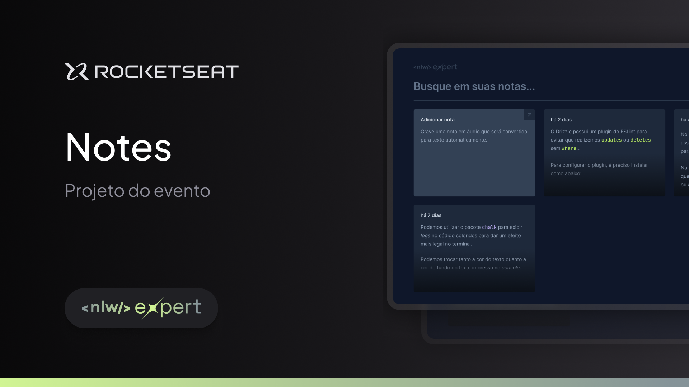

<p align="center">
  
</p>

<p align="center">NLW #14 Expert - Notes</p>

<p align="center">
  <a href="#-projeto">Projeto</a>&nbsp;&nbsp;&nbsp;|&nbsp;&nbsp;&nbsp;
  <a href="#-tecnologias">Tecnologias</a>&nbsp;&nbsp;&nbsp;|&nbsp;&nbsp;&nbsp;
  <a href="#-layout">Layout</a>&nbsp;&nbsp;&nbsp;|&nbsp;&nbsp;&nbsp;
  <a href="#-como-executar">Como Executar</a>&nbsp;&nbsp;&nbsp;|&nbsp;&nbsp;&nbsp;
  <a href="#-licença">Licença</a>&nbsp;&nbsp;&nbsp;|&nbsp;&nbsp;&nbsp;
  <a href="#autor">Autor</a>
</p>

<p align="center">
  
</p>

<br>

<p align="center">
  
</p>

## 💻 Projeto

Diferente de outros aplicativos de notas, o Notes é uma aplicação em que você pode gravar uma nota usando áudio que será convertido em texto automaticamente, isso é feito usando a interface da própria web, sem necessidade de contas externas, utilizando a [Speech Recognition API](https://developer.mozilla.org/en-US/docs/Web/API/SpeechRecognition), disponível nos navegadores modernos.

Além disso, criamos um aplicativo responsivo, aprendendo sobre estilização e responsividade. Foi abordado também a acessibilidade da aplicação e a criação de modais.

Este é um projeto desenvolvido em aula no evento NLW expert, um evento gratuito em programação, promovido pela [Rocketseat](https://www.rocketseat.com.br).

## 🚀 Tecnologias

Esse projeto foi desenvolvido com as seguintes tecnologias:

- [ReactJS](https://reactjs.org/)
- [Typescript](https://www.typescriptlang.org/)
- [Tailwindcss](https://tailwindcss.com/)
- [Radix](https://www.radix-ui.com/)
- [Sonner](https://sonner.emilkowal.ski/)
- [Vite](https://vitejs.dev/)
- [Local Storage](https://developer.mozilla.org/pt-BR/docs/Web/API/Window/localStorage)
- [Speech Recognition API](https://developer.mozilla.org/en-US/docs/Web/API/SpeechRecognition)

## 🔖 Layout

Você pode visualizar o layout do projeto através [DESSE LINK](https://www.figma.com/community/file/1336456128647909148/nlw-expert-notes). É necessário ter conta no [Figma](https://figma.com) para acessá-lo.

## 🎲 Como executar

Clone este repositório

```bash
git clone https://github.com/jordane-chaves/nlw-expert-notes.git
```

Acesse o diretório da aplicação

```bash
cd nlw-expert-notes
```

Faça a instalação das dependências

```bash
npm install
```

Execute a aplicação

```bash
npm run dev
```

## 📝 Licença

Esse projeto está sob a licença MIT.

## Autor


<br />

Feito com 💜 por Jordane Chaves